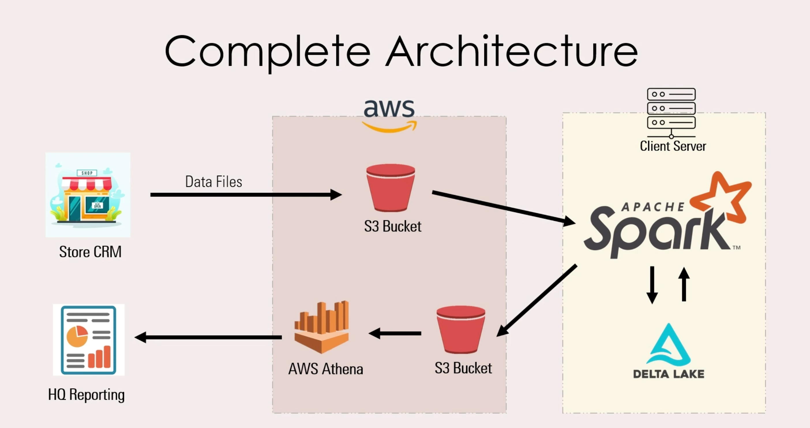
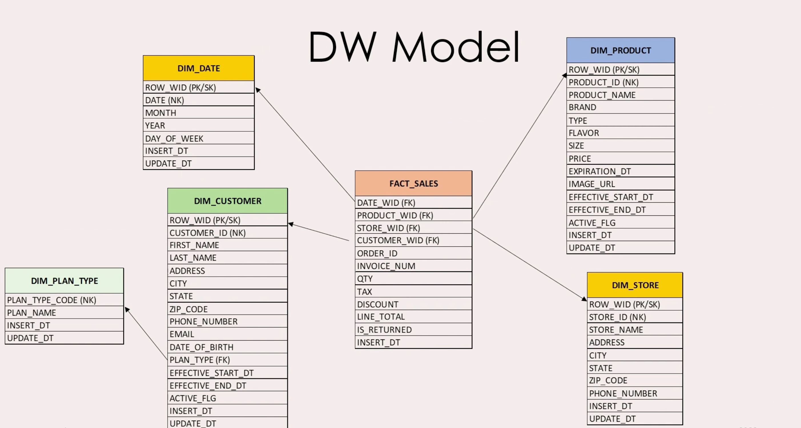
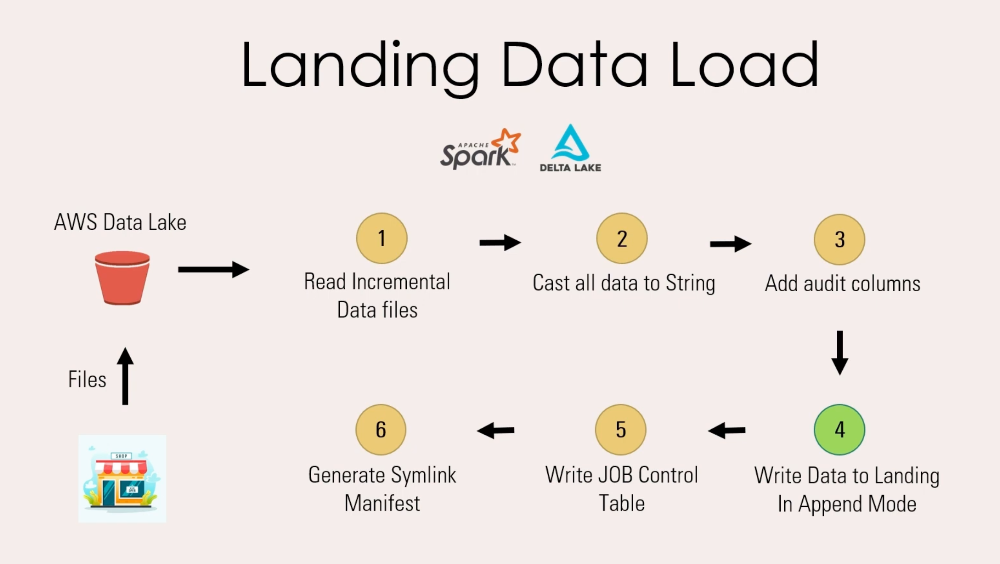
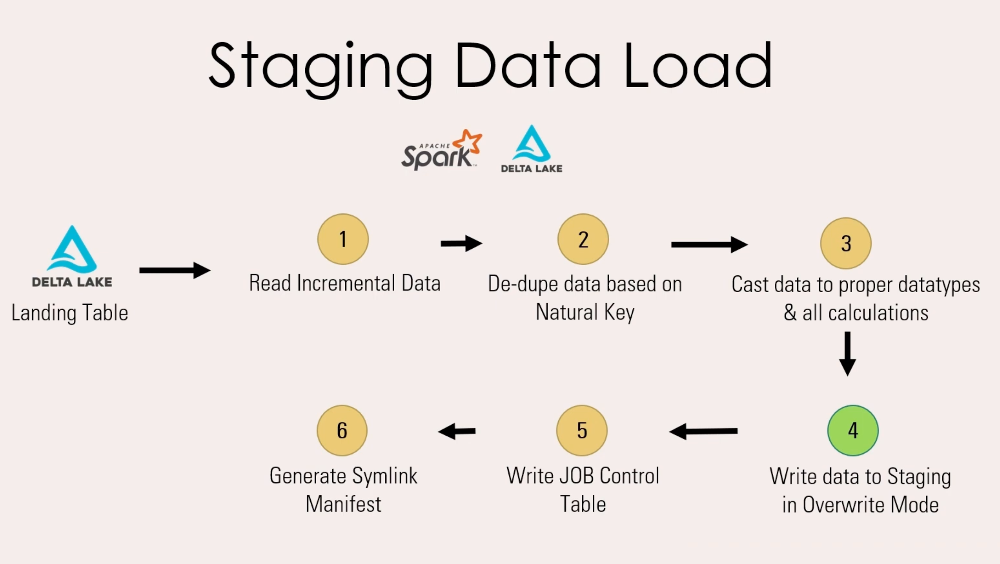
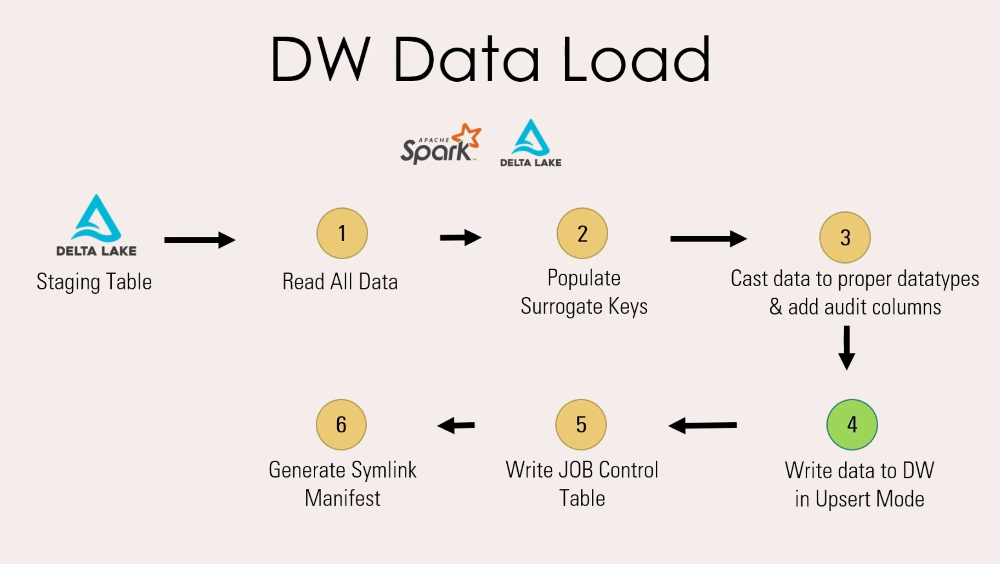

# 🛒 Retail Store Analytics — Data Engineering Project

An end-to-end **Retail Data Engineering Project** built using **AWS, PySpark, and Delta Lake**, following **Kimball dimensional modeling** with a **snowflake analytics schema**.

This project is an inspiration from *Ease With Data*.

---

## 📌 Architecture Overview

**Flow:**
- Raw retail data → AWS S3
- Transformations using PySpark
- Delta Lake for reliable storage
- Analytics-ready fact & dimension tables

---

## 🧱 Data Modeling (Snowflake Schema)

- Fact Tables: Sales/orders  
- Dimension Tables: Product, Customer, Store, Date, Plan Type
- Designed using **Kimball methodology**

---

## ⚙️ Data Load Process

**Landing Data Load** :
Incremental Data from Source is appended to the landing area.

---
**Staging Data Load** :
Incremental Data from Landing Area is transformed/enriched and overwritten into the Staging area.

---
**DataWareHouse Data Load** :
All the Data from Staging Area is written in Upsert Mode(SCD1, SCD2) in to the datawarehouse

